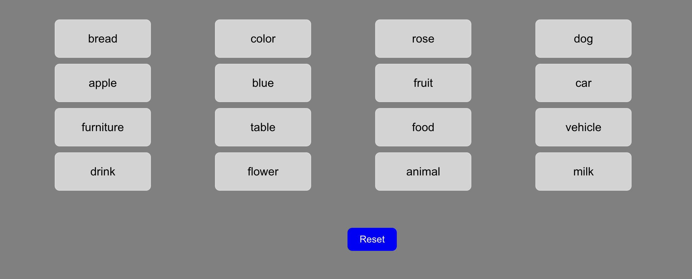
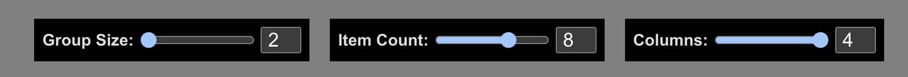
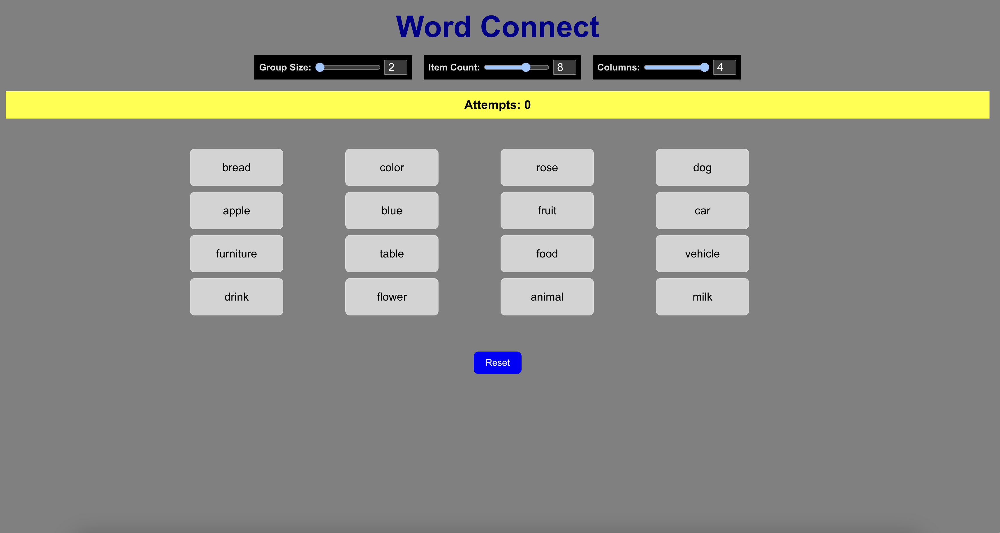

# Word Connect

Word Connect is an interactive game where users match pairs or groups of related words. The game provides customizable configurations for group size, number of items, and grid layout, ensuring a dynamic and engaging user experience.

## Features

- **Customizable Settings**: Adjust group size, item count, and grid columns via the configuration panel.
- **Interactive Game Board**: Shuffle and match groups of related words.
- **Visual Feedback**: Displays matched, mismatched, and selected states with distinct colors.
- **Attempts Tracker**: Keeps count of the user's attempts.
- **Responsive Design**: Optimized for both desktop and mobile devices.

---

## Table of Contents

- [Demo](#demo)
- [Usage](#usage)
- [Game Rules](#game-rules)
- [Project Structure](#project-structure)
- [Customization](#customization)
- [License](#license)

---

## Demo

### Screenshots
1. **Game Board View**  
   

2. **Configuration Panel**  
   

3. **Main Screen** 
    
---

## Usage

### Adjust Game Settings
1. Use the Configuration Panel to set:

    * `Group Size`: Number of words in each related group (2-4).

    * `Item Count`: Total groups to include (4-10).

    * `Columns`: Number of columns in the game grid (2-4).

2. Click on the words to form a group. Matching groups will turn green, incorrect matches will flash red, and selected words will be highlighted in blue.

3. Reset the game using the Reset button.

---

## Game Rules

1. Select the correct number of words (as per the group size) to form a valid group.

2. Match all groups to complete the game.

3. The number of attempts is tracked to measure your efficiency.

---

## Project Structure

```perl
word-connect/
├── public/
│   ├── index.html
│   └── favicon.ico
├── src/
│   ├── components/
│   │   ├── ConfigPanel.js   # Settings Panel Component
│   │   └── GameBoard.js     # Main Game Board Component
│   ├── App.js               # Main App Component
│   ├── App.css              # Styling for App
│   ├── index.js             # React Entry Point
│   └── index.css            # Global Styles
├── package.json             # Project Dependencies
└── README.md                # Documentation
```

---

## Customization

### Modifying Related Word Groups
To add or modify the groups of related words:

1. Open GameBoard.js.

2. Locate the relatedWords array.

3. Add, remove, or edit the word groups

```javascript
const relatedWords = [
    ["new", "group", "example"],
    ["another", "sample"]
];
```

### Styling
* Customize the appearance by editing the App.css file.
---

## License
This project is licensed under the MIT License.